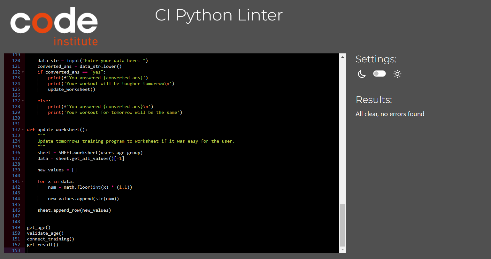

# Workoutplan

Workoutplan is a platform for people in all ages that needs help to get into training. The exercises are few, which gives anyone time to take on this challenge. 

---

## How does it work?

* The user get asked about their age and gets to fill it in.
* Depending on the users age a training program is shown with exercises and how many times the user should do them.
* The user then gets asked if the workout was easy.
* Incase the workout was easy it will be increased by 10% for the next day and and the new program will be added to the spreadsheet.

## Features

* Get age messages the user to add their age.
* Validate age is a while loop that will continue until the user has put an age in numbers.
* Read sheet is a while loop that makes the apperance of the information gotten from the sheet being read, exercise and the amount of times it should be done. Without it the names of the exercises would be read out first and then the amount of reps.
* Connect training makes the user access the right training program depending on the age that they put.
* Get result asks if the user thought the training was easy.
* Update worksheet will incase the user thought it was easy take the list and convert it to numbers using a for loop. Then it will add on 10% (and convert to even numbers), then make it a list again and add it on a new row in the spreadsheet.
* To being able to access the sheet and add the new training correctly a global variable is created to make it possible.

## Technologies used

- [Python](https://www.python.org/) is the language used to achive my goals with this app.
    - To access my spreadsheet I used [Gspread](https://docs.gspread.org/en/latest/)        
    - To get access I used [Google Auth](https://google-auth.readthedocs.io/en/master/)
- [GitHub](https://github.com/) stored my app from the first time I pushed it.
- [Gitpod](https://www.gitpod.io/) made it possible to write my code.
- [Heroku](https://dashboard.heroku.com/apps) is where I depoyed my app.ct.
- [Google Sheets](https://www.google.co.uk/sheets/about/) used to store all workout programs and process.
- [Pep8](http://pep8online.com/) was used to test my code for any issues or errors.

## Testing

To test the application I've tried to enter all different ages and not ages to the first input field in the terminal. In case it's not a valid age written in numbers it will sincerely continue asking until it receives a proper answer.

After entering a valid age the user gets is workout plan from the right program. The programs are:
1. Teenager 0-2o years
2. Adult 21-35 years
3. Mid life 36-50 years
4. Elder 51-70 years
5. Senior 71 and above

All programs starts by telling the user the program they where given and then shows the exercises and reps.

After the workout the user get to fill in if thet thought the workout was easy to being able to add on 10% for the next workout.

The new workout then gets added to the spreadsheet to being accessed for next time.

This work for all ages and a new program is only added to the sheet when it is being increased.

## Bugs and fixes

During the applications creation time I've ran into alot of issues, but with a calm mind and help from different mentors I managed to clear everything out and the app runs through [Pep8](http://pep8online.com/) with out any errors.

--- 

## Deployment

In my repositry I've used the master branch to deploy workoutplan.

## Deployment
The workoutplan was deployed through Github pages.

* In github repository go to settings.
* Go to pages and use the branch menu to change to main.
Refresh teh page and a link to the final project is deployed.

* On the main site there is a fork button to create your own repository without affecting the orginal project or you could go into the project file and use the code button and clone the project directly.

## Creating a app on Heroku

(This next part isn't described by me)
This app is deployed on Heroku.

When you create the app, you will need to add two buildpacks from the _Settings_ tab. The ordering is as follows:

1. `heroku/python`
2. `heroku/nodejs`

You must then create a _Config Var_ called `PORT`. Set this to `8000`

If you have credentials, such as in the Love Sandwiches project, you must create another _Config Var_ called `CREDS` and paste the JSON into the value field.

Connect your GitHub repository and deploy as normal.

## Credits

All coding for this application is written by me. I've taken help from mentors and [Stack Overflow](https://stackoverflow.com/).

The repositry is taken from AJ Greaves the teacher.